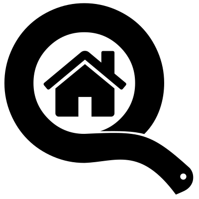

.. raw:: html

    

============================================
Microhomie - Documentation and Specification
============================================

Contents
========

.. rst-class:: clearfix row

.. rst-class:: column

:ref:`Get started <introduction>`
---------------------------------

Start here with hands-on examples.

.. rst-class:: column

:ref:`How-to guides <howtoguides>`
----------------------------------

Step-by-step guides for the developer covering key operations and procedures

.. rst-class:: column

:ref:`Reference <reference>`
----------------------------

Technical reference - tools, components and commands

.. rst-class:: column

:ref:`Background <background>`
------------------------------

Explanation and discussion of key topics

.. rst-class:: clearfix row

About this documentation
========================

This documentation is the central hub of information for all things Microhomie.

What is Microhomie?
===================

Microhomie is a MicroPython framework for `Homie <https://github.com/homieiot/convention>`_, a lightweight MQTT convention for the IoT.

Main target for Microhomie is the ESP8266 device but has been well tested and used on ESP32 too.

Source is on `GitHub <https://github.com/microhomie/microhomie>`_.

Notational Conventions
======================

The key words "MUST", "MUST NOT", "REQUIRED", "SHALL", "SHALL NOT", "SHOULD", "SHOULD NOT", "RECOMMENDED", "NOT RECOMMENDED", "MAY", and "OPTIONAL" are to be interpreted as described in [RFC 2119](http://tools.ietf.org/html/rfc2119).

The key words "unspecified", "undefined", and "implementation-defined" are to be interpreted as described in the [rationale for the C99 standard](http://www.open-std.org/jtc1/sc22/wg14/www/C99RationaleV5.10.pdf#page=18).

An implementation is not compliant if it fails to satisfy one or more of the MUST, MUST NOT, REQUIRED, SHALL, or SHALL NOT requirements for the protocols it implements.
An implementation is compliant if it satisfies all the MUST, MUST NOT, REQUIRED, SHALL, and SHALL NOT requirements for the protocols it implements.

Detailed table of contents
==========================

.. toctree::
   :maxdepth: 2

   introduction/index
   howto/index
   reference/index
   background/index

Indices and tables
------------------

* :ref:`genindex`
* :ref:`search`
