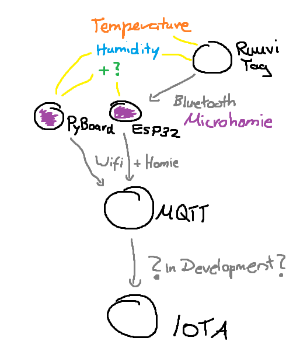
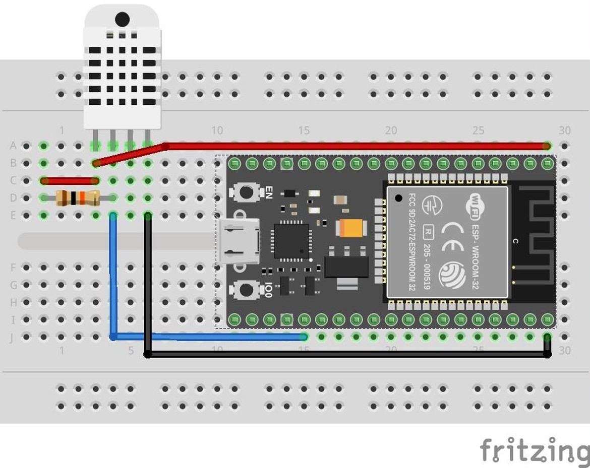
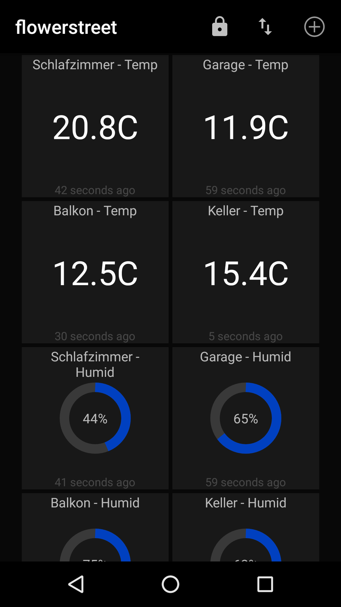

Quickstart
==========

Overview
--------

This project consists of 3 main components:

- the Microhomie sensor (hardware and software)
- the MQTT server (selfhosted or you can use a service, see below)
- the homie -> IOTA gateway (selfhosted)

First, take a look at this awesome architectural drawing:

This guide will take care of the purple ESP32 / Microhomie device with the requried hardware and software. 

Install the MicroPython
------------------------

For now, follow this tutorial (https://www.cnx-software.com/2017/10/16/esp32-micropython-tutorials/) to install MicroPython on the ESP. Please remember to use the latest version of the ESP software during the installation.

.. important::  On some boards, the installation of MicroPython will fail with an "connection timeout" if you have any wires attached to the board. This depends on your board and you have to detach all wires except power for the basic installation to work. This is only relevant for the installation of MicroPython and not Microhomie.

Once the installation is successful and you are able to execute python code on the ESP32, you can install Microhomie.

Install Microhomie
------------------------

Microhomie is split in two parts, the base package and a node package with additional functions. We require the DHT22 node from the node package for this tutorial.

We provide some example nodes in the https://github.com/microhomie/micropython-homie-nodes repository. Most of these nodes can be used out of the box to publish data.

The base package and the node package can be installed via PyPi or manual. As of the time of this writing, the PyPi way of installing is prefered.

.. include:: installation_base/_index.rst 

.. include:: installation_base/pypi.rst 

Add files specific for your device
-----------------------------------------
You now have Micropython adn Microhomie installed. The stage is set!

Please copy a new `main.py` file on the device::

    import utime
    import settings
    
    from homie.node.dht22 import DHT22
    from homie import HomieDevice
    
    
    # Homie device setup
    homie_device = HomieDevice(settings)
    homie_device.add_node(DHT22(interval=60, pin=2))
    homie_device.publish_properties()
    
    while True:
        # Push the new data to MQTT
        homie_device.publish_data()
        # Sleep a little bit
        utime.sleep(1)
        

Soldering it
--------------

You need the following hardware:

- ESP32 NodeMCU (Amazon referral link de: http://amzn.to/2En655Q / en: http://amzn.to/2GUmdKz)
- 10 k Ohm resistor
- DHT22 (Amazon referral link de: http://amzn.to/2FU84f4 / en: http://amzn.to/2FUg0wY)
- Wires

You don't have to get the stuff on Amazon. Other places are cheaper, Amazon is just easier and for general reference.

Wire it all up:

The final result will look something like this. This includes the DHT22 for temperature and humidity AND the SDS011 for airquality which is not part of this quickstart but can be added later on as you can see:

Prepare MQTT
---------------

Checkout mosquitto MQTT Server (https://mosquitto.org/) if you want to host a server yourself or head over to IO Adafruit(https://io.adafruit.com/), createn an account and use their MQTT API(https://learn.adafruit.com/adafruit-io/mqtt-api).

If everything is setup correctly, the data will then be pushed to the MQTT server in the homie format. Take a look at the homie documentation(https://github.com/marvinroger/homie) to get an idea of the possibilities. ::

    homie/686f6d6965/temperature/$type → temperature
    homie/686f6d6965/temperature/$name → Bedroom Temperature Node
    homie/686f6d6965/temperature/$properties → degrees
    homie/686f6d6965/temperature/degrees/$settable → false
    homie/686f6d6965/temperature/degrees/$unit → C
    homie/686f6d6965/temperature/degrees/$datatype → float
    homie/686f6d6965/temperature/degrees/$name → Bedroom Temperature
    homie/686f6d6965/temperature/degrees/$format → -20.0:60
    homie/686f6d6965/temperature/degrees → 12.07
    
    homie/686f6d6965/humidity/$type → humidity
    homie/686f6d6965/humidity/$name → Bedroom Humidity Node
    homie/686f6d6965/humidity/$properties → percentage
    homie/686f6d6965/humidity/percentage/$settable → false
    homie/686f6d6965/humidity/percentage/$unit → %
    homie/686f6d6965/humidity/percentage/$datatype → integer
    homie/686f6d6965/humidity/percentage/$name → Bedroom Humidity
    homie/686f6d6965/humidity/percentage/$format → 0:100
    homie/686f6d6965/humidity/percentage → 79

Mobile App
-------------

You can chose from multiple Apps for Android / iOS / Desktop to display the sensor data. You have to subscribe to the topics you are interested in, for example `homie/686f6d6965/humidity/percentage` and `homie/686f6d6965/temperature/degrees`.  

- MQTT Dash: https://play.google.com/store/apps/details?id=net.routix.mqttdash

Send Data to IOTA with the homie-iota-gateway
-------------------------------------------------

This is still the great unknown. The good news is, the data can be gathered with Microhomie in the Homie format (or by other systems!) and its waiting in MQTT. 

We already have boilerplate code in place, which subscribes in real time to updates of the data in MQTT and it can be configured. We just need the "push to IOTA" part when the data marketplace is public!

You can follow the final development on Github https://github.com/microhomie/homie-iota